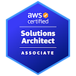
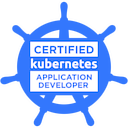
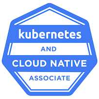

# 👋 Hello! I'm JM

I'm a **Solutions Architect** and **Backend Developer** based in **Manila, Philippines**. With a passion for **serverless architectures**, **containerization**, and **CI/CD automation**, I specialize in building scalable and efficient backend systems.

## 🌟 About Me

- 🌍 **Location**: Manila, Philippines
- 💼 **Role**: Solutions Architect | Backend Developer
- 🚀 **Interests**: Serverless Architectures, Containerization, CI/CD Automation

## 🏅 Certifications

- 🏆 [AWS Solutions Architect Associate](https://www.credly.com/badges/e8170fa8-094f-496a-9c5b-7fddec5a9e43/public_url)
- 🏆 [Certified Kubernetes Application Developer (CKAD)](https://www.credly.com/badges/88fcdab0-aa5d-4816-a9d4-f4c6bda4340d/public_url)
- 🏆 [Kubernetes and Cloud Native Associate (KCNA)](https://www.credly.com/badges/kcna-badge-url-here)

## 💻 Technical Skills

### Tools & Platforms

- 🛠️ **Development Tools**: GitHub, VSCode, IntelliJ IDEA, GitHub Copilot, ChatGPT, SourceTree, PlantUML
- ☁️ **Cloud Platforms**: AWS, Kubernetes
- 📊 **Monitoring & Observability**: Grafana, Kibana, AWS CloudWatch
- 🔧 **Pipeline as Code**: GitLab CI/CD, BitBucket CI/CD, GitHub Actions, GoCD, ArgoCD
- 💰 **Payment Processing**: Stripe

### Programming

- 🖥️ **Languages**: JavaScript, Go, Java, Spring Boot
- ⚙️ **Frameworks**: Serverless Framework, Spring Boot
- 🏃🏻 **Runtime Environments**: Node.js, JVM

### Scripting

- 💾 **Scripting**: Bash, Shell Scripting

### Software Development Concepts

- ⚙️ **Architectural Patterns**: Event-Driven Architecture, Microservices, Solutions Architecture
- 🔗 **Integration & Communication**: RESTful APIs, gRPC, Message Queues
- 🗄️ **Databases**: SQL Databases (MySQL, Postgres, Amazon Aurora), Database Sharding, NoSQL Databases (DynamoDB, MongoDB, Redis, Memcached)
- 🔒 **Performance & Security**: API Rate Limiting, Code Observability, Monitoring
- 🔍 **Lifecycle Management**: Post-Production Support & Troubleshooting, ETL

## 🏢 Domain Expertise

- 💳 **Fintech**
- 🏦 **Banking**
- 📡 **Telecommunications**

## 📫 Let's Connect!

- 🌐 [Personal Website](https://hollabalo.github.io)
- 💼 [Upwork Profile](https://www.upwork.com/freelancers/~01a2b3c4d5e6f7g8h9)

## 🎖️ Badges

  
  
  

